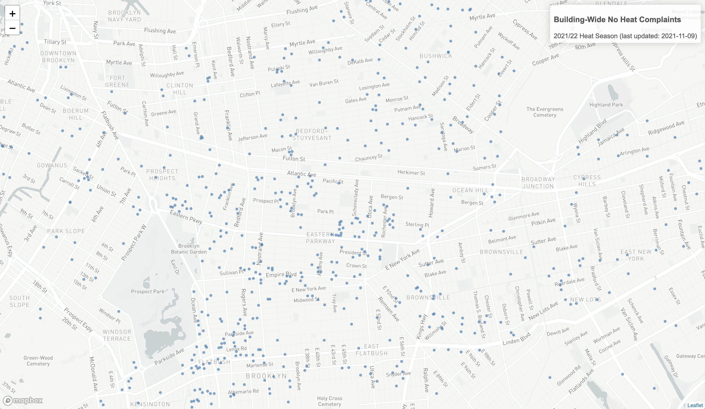

# Brooklyn Eviction Defense - Building-Wide No Heat Complaints Map

Map of buildingwide complaints for no heat in Brooklyn during the 2021/22 heat season for [Brooklyn Eviction Defense](https://brooklynevictiondefense.org/).

**[See the map!](https://austensen.github.io/bk-no-heat/map.html)**

## Data

All the data for this map is from [NYCDB](https://github.com/nycdb/nycdb), a project of the [Housing Data Coalition](https://www.housingdatanyc.org/), which provides access to public NYC housing data for the tenants movement.

## Installation

You'll need to download and install both [R](https://cloud.r-project.org/) and [RStudio](https://rstudio.com/products/rstudio/download/#download).

This project uses [`renv`](https://rstudio.github.io/renv/articles/renv.html) to handle dependency management. To get this project set up on your own system, open the project in RStudio (and open the `.Rproj` file), install `renv` (`install.packages("renv")`), and run `renv::init()`. 

## Environment variables

Edit `.env_sample` to fill in the variables and save it as `.env`. 

MapboxGL is used to have a nicer basemap. You can sign up for a [free Mapbox API key](https://account.mapbox.com/auth/signup/).

The NYCDB PostgreSQL database connection credentials are included to extract data from the Housing Data Coalition's NYCDB instance. See [NYCDB](https://github.com/nycdb/nycdb) for details on building it yourself or getting access to the Housing Data Coalition's instance.

